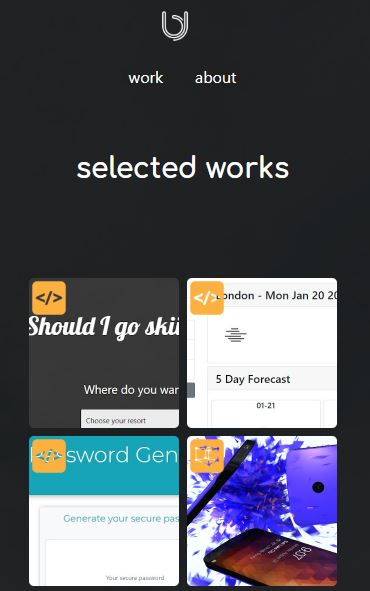

Updated Portfolio

Repository: https://github.com/aarkitekkt/updatedPortfolio

URL: https://aarkitekkt.github.io/updatedPortfolio

Overview
​The purpose of this application is to display examples of my design work and provide contact information to potential employers and collaborators.​

##Gallery
Home:

Work:

Responsive:

About:

##Problem
​The biggest challenge faced in building this application was dynamically displaying content for a project when the thumbnail image is clicked.
​

##Solution
​By creating an object variable containing every project shown with all of the necessary key/value pairs I was able to write a function that would pull an ID from the selected image and use that ID to retrieve data from the correct object and dynamically render to the page.

##Tech and Features Used​

Bootstrap
Javascript
jQuery

##How to use
​Click on an image thumbnail in order to see a larger project image and view links to the deployed url and github.​

##Technical Overview​

1. When an thumbnail image is clicked on, a function using (this).attr() grabs the ID from the image html and assigns it to a variable.
2. A for loop runs through the projects array to check if the ID variable matches the ID for a specific project within the array.
3. When a match is found, I use jQuery to grab values from that object and append them to the attributes of the html elements so that the corresponding images and links will be rendered in the appopriate element.
4. When a different image is click, the same function grabs the new values and replaces the attributes to render the new project.

